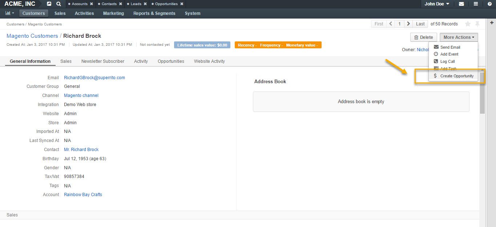
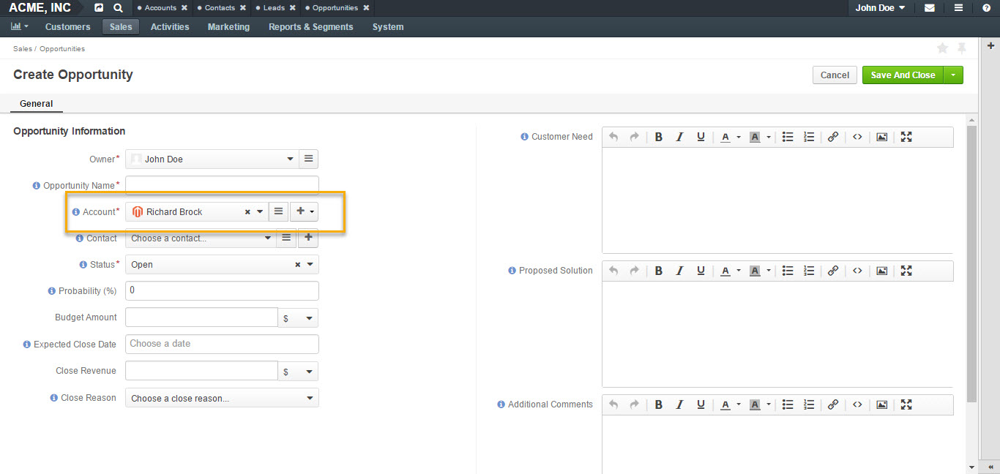
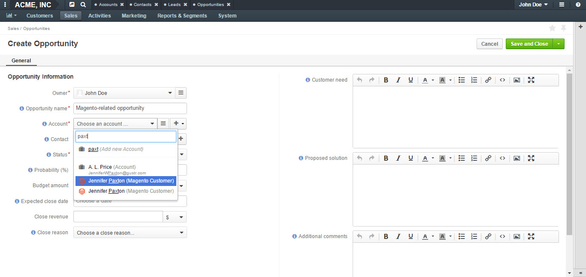
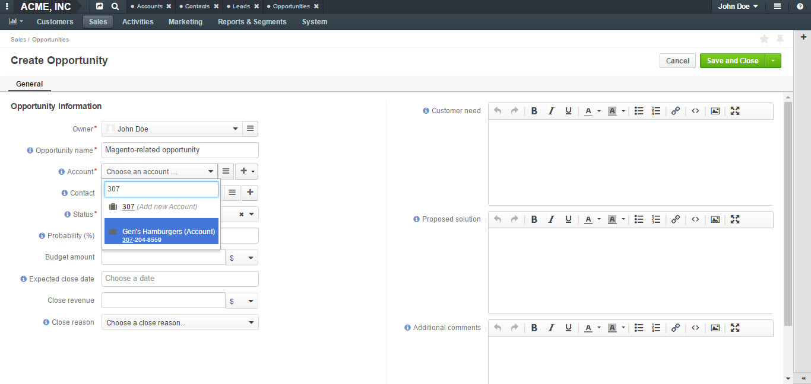
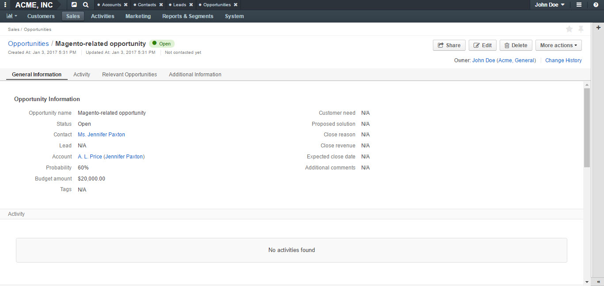

.. _user-guide-opportunities-create:

Create Opportunities from Magento Customers
-------------------------------------------

.. begin_create_an_opportunity

To create an opportunity from a Magento customer view page:

-	Go to **Customers** in the main menu, click **Magento Customers**.
-	Select a Magento customer from the grid and open their view page.
-	Navigate to **More Actions** in the top right corner.
-	Click **Create Opportunity** from the list.
-	A **Create Opportunity form** will open with an **Account** field already filled in with your selected Magento customer.

.. _user-guide-opportunities-create--from-account:

Relate Opportunity to an Account
~~~~~~~~~~~~~~~~~~~~~~~~~~~~~~~~

If you have different Magento stores and different Magento customers in every store and you wish to track your sales via sales opportunities and create opportunities related to specific Magento customers. In the following example, we have created a new opportunity related to a Magento customer:

In the **Account** dropdown, you will see groups of accounts and customers. Each group will have at least one account. The types of the customers displayed in the dropdown will depend on the active channels in your system. The customers will be identified by the corresponding logo.

In the given example, there is an option to relate the opportunity to an *A.L.Price account* and the customer (from 2 Magento channels) that belongs to the account.

Accounts can be searched for not only by their account name but also contact name, email or phone.

Once saved, this opportunity will be related to an account via a customer.

