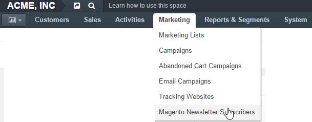

.. _user-guide-magento-entities-newsletters:

Magento Newsletter Subscribers
==============================

If the Magento Newsletter Subscribers entity has been assigned to a channel
of Magento type, after the synchronization the list of all the
Magento Customers assigned to Magento Newsletter will be uploaded to OroCRM.

.. caution::

    The Magento Newsletter Subscribers are only supported with OroBridge version 1.1.5 or higher.

To see the Magento Newsletter Subscribers grid go to the **Marketing > Magento Newsletter Subscribers**.

From the grid of Magento Customers you can:

- Subscribe or unsubscribe Magento customers to/from the Magento Newsletter: |IcSub| or |IcUns|

- Get to the view page of the list :  |IcView|

  - You can also unsubscribe/subscribe customers to the newsletter with the button in the
    view page of a
    :ref:`Magento customer <user-guide-magento-entities-customers>`.

.. note::

    Editing the subscription list is only possible if
    :ref:`two-way synchronization <user-guide-magento-channel-integration-synchronization>` has been enabled.

.. include:: /img/buttons/include_images.rst
   :start-after: begin

